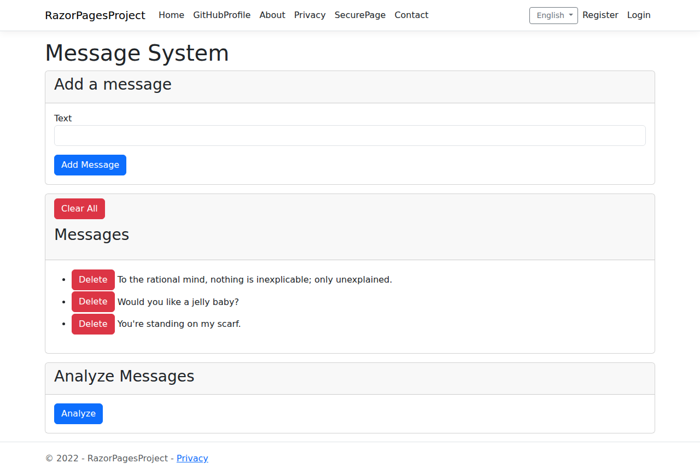
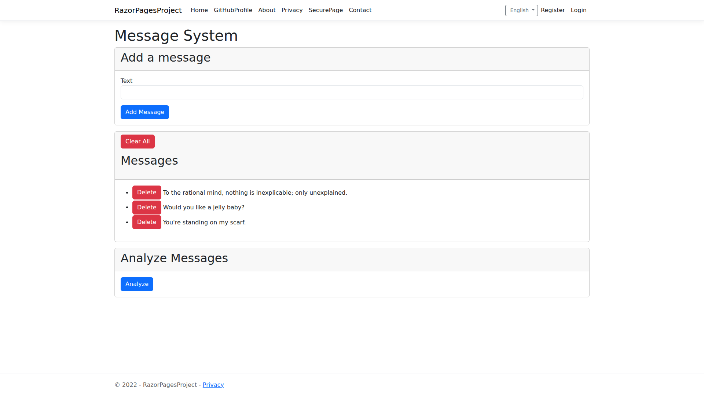
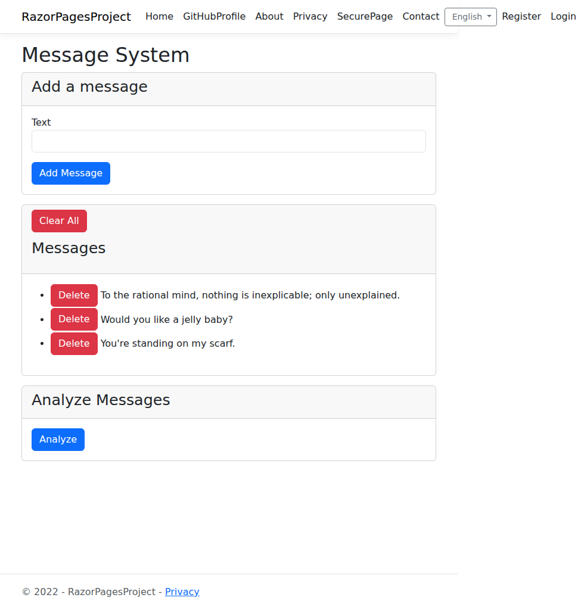
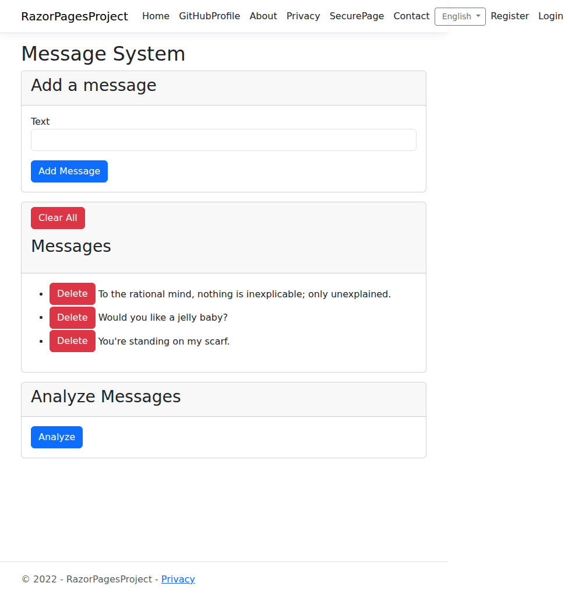
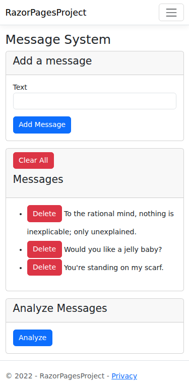
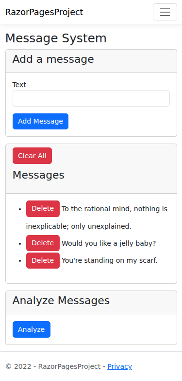
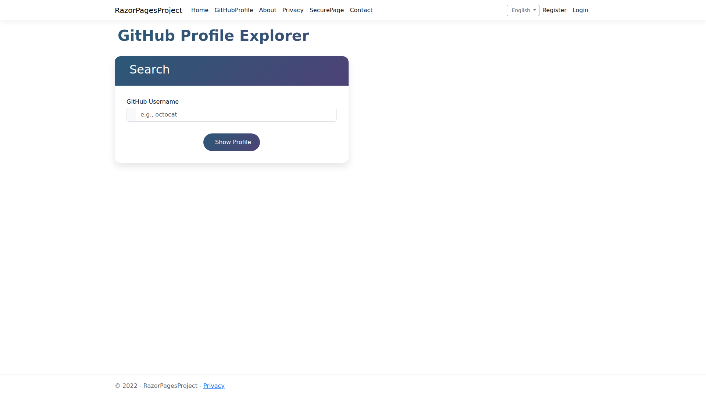

# Heading Hierarchy Fix - Visual Comparison

This document shows the before and after screenshots for the heading hierarchy fixes across Razor Pages.

## Changes Made

### Index.cshtml
- **Before**: h1 "Message System" → h3 "Add a message" / h3 "Messages" / h3 "Analyze Messages" ❌
- **After**: h1 "Message System" → h2 "Add a message" / h2 "Messages" / h2 "Analyze Messages" ✅

### GitHubProfile.cshtml  
- **Before**: h1 "GitHub Profile Explorer" → h3 "Search" / h3 "Profile" ❌
- **After**: h1 "GitHub Profile Explorer" → h2 "Search" / h2 "Profile" ✅

## Screenshots

### Index Page - Desktop View
**Before:**

**After:**

### Index Page - Tablet View  
**Before:**

**After:**

### Index Page - Mobile View
**Before:**

**After:**

### GitHub Profile Page - Desktop View
**Before:**

**After:**

### GitHub Profile Page - Tablet View
**Before:**

**After:**

## Impact Assessment

- ✅ **Visual Consistency**: No visual changes - Bootstrap handles h2 and h3 styling consistently
- ✅ **Accessibility**: Proper heading hierarchy for screen readers and keyboard navigation
- ✅ **SEO**: Improved semantic structure for search engines
- ✅ **Tests**: All 36 tests continue to pass
- ✅ **Build**: Project builds successfully with no errors

## Technical Details

- **Files Modified**: 2 files
- **Lines Changed**: 5 lines total (h3 → h2 replacements)
- **Breaking Changes**: None
- **CSS Impact**: None (Bootstrap handles heading styles)